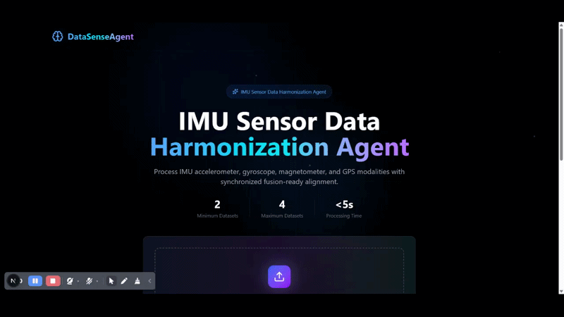
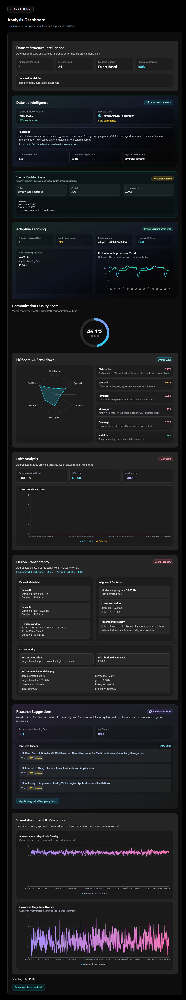

# SensorFusionAgent

> AI-first sensor harmonization platform for multi-dataset IMU workflows.

<p align="center">
  
  
  
  
</p>

## Product Preview

<p align="center">
  
</p>

<p align="center">
  <a href="assets/SensorFusionAgent_Workflow.mp4">Watch high-quality MP4 version</a>
</p>

### Results Dashboard Preview


SensorFusionAgent is a local-first, async AI system for harmonizing multi-dataset sensor time series (IMU-focused), generating transparency reports, and validating alignment quality with explainable metrics and dashboards.

It includes:
- A FastAPI backend with background job processing
- A Next.js dashboard for upload, progress tracking, and result visualization
- Fusion transparency, drift analysis, HQScore v4 breakdown, research suggestions, and agentic pre-fusion optimization
- Robust ingestion for CSV/folder/ZIP (including nested ZIP structures)
- Benchmark framework for evaluation

## What This Project Solves

Real-world sensor datasets often differ in:
- Sampling rate
- Timestamp format
- Column naming
- Units
- Drift and offsets
- Missing modalities

SensorFusionAgent standardizes and aligns those datasets into one fused output, while exposing *how* decisions were made.

## Current Capabilities

- Upload 2 to 4 datasets per run (`dataset1` and `dataset2` required)
- Accepted inputs: CSV files, folders, ZIP archives (recursively scanned)
- Multi-participant detection and grouping
- Rule-based + optional LLM-assisted schema inference
- Task/context inference (HAR, gait, driving, health, environmental, unknown)
- Async jobs with progress (`/fuse` -> `/status/{job_id}`)
- Fusion transparency report
- HQScore v4 with component breakdown
- Drift analysis (windowed offsets + DTW score)
- Visual overlays for accelerometer and gyroscope magnitudes
- Optional research suggestion engine (OpenAlex)
- Agentic decision layer (safe heuristic action search before fusion)
- Adaptive learning panel (historical model confidence and trend)
- Structured failures/warnings (no raw stack traces to client)

## Architecture (High Level)

```mermaid
flowchart LR
  A[Frontend Upload UI] --> B[POST /fuse]
  B --> C[Job DB row created]
  C --> D[Background fusion job]
  D --> E[Ingestion + schema/task inference]
  E --> F[Agentic runtime]
  F --> G[Alignment + resampling + merge]
  G --> H[HQScore v4 + drift + visual data]
  H --> I[Research suggestions]
  I --> J[Persist result_json]
  J --> K[GET /status/{job_id}]
  K --> L[Results Dashboard]
```

<p align="center">
  
</p>

<p align="center"><em>Verified agentic runtime flow (planner-executor-observer safety loop + async orchestration).</em></p>

Detailed module map: `docs/ARCHITECTURE.md`

## Repository Layout

- `app/api.py`: FastAPI API routes, job orchestration, error middleware
- `app/agent/loop.py`: core harmonization pipeline
- `app/agent/runtime.py`: agentic safe action loop (pre-fusion optimization)
- `app/ingestion/structure_intelligence.py`: CSV/ZIP ingestion + participant/schema/timestamp inference
- `app/core/hqscore_v4.py`: research-grade scoring components
- `app/core/drift_analysis.py`: drift + DTW + stability metrics
- `app/core/continual_learning.py`: adaptive model training/recommendation
- `app/research/`: OpenAlex querying + suggestion synthesis
- `sensorfusion-dashboard/`: Next.js frontend
- `sample_datasets/`: ready-to-upload demo ZIP datasets
- `run_benchmarks.py` + `benchmarks/`: benchmark framework

## Local Setup

### 1) Prerequisites

- Python 3.12+
- Node.js 20+ and npm
- Linux/macOS shell

### 2) Backend setup

```bash
cd /home/aditya/projects/SensorFusionAgent
python3 -m venv senenv
source senenv/bin/activate
pip install -r requirements.txt
```

### 3) Frontend setup

```bash
cd /home/aditya/projects/SensorFusionAgent/sensorfusion-dashboard
npm install
```

### 4) Environment variables

Create your local env file from template (do not commit real secrets):

```bash
cd /home/aditya/projects/SensorFusionAgent
cp .env.example .env
```

Then edit `/home/aditya/projects/SensorFusionAgent/.env`:

```env
# Required for LLM-backed features (schema/advisor modules)
OPENAI_API_KEY=your_openai_api_key

# Optional runtime/safety controls
FUSION_JOB_TIMEOUT_SECONDS=300
MAX_DATASET_ROWS=1000000
STRICT_MAX_ROWS=0

# Agentic runtime toggles
AGENTIC_RUNTIME_ENABLED=1
AGENTIC_MIN_IMPROVEMENT=0.002
AGENTIC_EVAL_MAX_ROWS=50000
AGENTIC_ENABLE_UNIT_SCALE=1
AGENTIC_ENABLE_AXIS_INVERT=1
AGENTIC_ENABLE_SMOOTHING=1
AGENTIC_SMOOTHING_NOISE_RATIO=1.35
AGENTIC_SMOOTHING_WINDOW=5
AGENTIC_SMOOTHING_MAX_COLUMNS=6

# Adaptive learning
ADAPTIVE_MODEL_DIR=models/adaptive
ADAPTIVE_TRAIN_EVERY_N=20
ADAPTIVE_MIN_SAMPLES=20
ADAPTIVE_CONFIDENCE_THRESHOLD=0.7
```

### OpenAI API key (important)

- File: `/home/aditya/projects/SensorFusionAgent/.env`
- Key: `OPENAI_API_KEY=<your_key>`
- Used by LLM-assisted components (schema inference fallback and advisor-style extraction paths).
- If not set, those LLM-backed paths fall back to non-LLM behavior, but core fusion still works.

Frontend env (optional):

File: `/home/aditya/projects/SensorFusionAgent/sensorfusion-dashboard/.env.local`

Create from template:

```bash
cd /home/aditya/projects/SensorFusionAgent/sensorfusion-dashboard
cp .env.local.example .env.local
```

```env
NEXT_PUBLIC_FUSE_API_URL=http://localhost:8000/fuse
NEXT_PUBLIC_FUSE_API_BASE=http://localhost:8000
```

### Do I need an OpenAlex API key?

- No. OpenAlex works endpoint is public.
- Internet access is required for papers to populate.
- If OpenAlex cannot be reached, the system returns a safe default suggestion with empty papers.

## Running Locally

### Backend

```bash
cd /home/aditya/projects/SensorFusionAgent
./run_api.sh
```

Starts FastAPI on `http://localhost:8000`.

### Frontend

```bash
cd /home/aditya/projects/SensorFusionAgent/sensorfusion-dashboard
npm run dev
```

Open `http://localhost:3000`.

### Production frontend build check

```bash
cd /home/aditya/projects/SensorFusionAgent/sensorfusion-dashboard
npm run build
```

## API Contract

### `POST /fuse`

Starts an async fusion job.

Request form-data:
- `dataset1` required (file)
- `dataset2` required (file)
- `dataset3` optional
- `dataset4` optional
- `sampling_rate` optional (float)
- `alignment_mode` optional (currently normalized to `classical`)

Response:

```json
{
  "job_id": "uuid",
  "status": "processing"
}
```

### `GET /status/{job_id}`

While running:

```json
{
  "job_id": "uuid",
  "status": "processing",
  "progress": 45
}
```

On success:

```json
{
  "job_id": "uuid",
  "status": "completed",
  "progress": 100,
  "result": {
    "fusion_report": {},
    "visual_data": {},
    "hqscore": 0.81,
    "confidence": { "level": "High", "reason": "..." }
  }
}
```

On failure:

```json
{
  "job_id": "uuid",
  "status": "failed",
  "progress": 100,
  "error": {
    "error_type": "invalid_csv",
    "message": "Invalid or corrupted CSV file.",
    "details": {}
  }
}
```

### `GET /research_suggestions/{job_id}`

Returns progress and suggestion payload, including papers list if available.

### `POST /research_suggestions/{job_id}/apply`

Starts a new fusion job using suggested sampling rate.

### `GET /download/{job_id}`

Downloads fused CSV output.

## Supported Dataset Structures

You can upload:
- A single CSV file
- A folder containing CSV files
- A ZIP file containing CSV files
- Nested ZIP/folder structures

Examples:

```text
dataset/
  participant_01/
    accelerometer.csv
    gyroscope.csv
  participant_02/
    accelerometer.csv
    gyroscope.csv
```

```text
dataset.zip
  raw/
    participant_01/
      acc.csv
      gyro.csv
```

Rules:
- System recursively scans for `.csv`
- Non-CSV files are ignored
- Timestamp column is required and auto-detected from names like `timestamp`, `time`, `ts`, `datetime`
- At least 2 datasets (slots) are required per fusion run

## Included Sample Datasets

To make GitHub testing easy, the repo includes two small synthetic ZIP datasets:

- `sample_datasets/dataset1_sample.zip`
- `sample_datasets/dataset2_sample.zip`

Each ZIP contains:

```text
participant_01/
  accelerometer.csv
  gyroscope.csv
```

Quick test flow:
1. Start backend: `./run_api.sh`
2. Start frontend: `cd sensorfusion-dashboard && npm run dev`
3. Open `http://localhost:3000`
4. Upload `dataset1_sample.zip` as Dataset 1 and `dataset2_sample.zip` as Dataset 2
5. Click **Analyze Dataset with AI**

## Metric Definitions

### HQScore v4 (0 to 1)

Weighted composite score from:
- Distribution similarity
- Spectral similarity
- Temporal alignment strength
- Missingness penalty (inverse)
- Sensor coverage
- Stability factor

Higher is better.

### HQScore v4 components

- `distribution_similarity`: combines symmetric KL similarity and Wasserstein similarity
- `spectral_similarity`: dominant-frequency similarity + coherence on magnitude signals
- `temporal_alignment_strength`: normalized cross-correlation peak + lag quality
- `missingness_penalty`: weighted missing data ratio by modality importance
- `sensor_coverage`: weighted modality coverage
- `stability_factor`: drift stability + SNR consistency

### Drift analysis

- `drift_type`: `none` / `minor` / `significant`
- `average_window_offset`: mean abs offset in sliding windows
- `dtw_score`: normalized DTW distance
- `stability_score`: 0 to 1, higher is more stable
- `offset_trend`: time-indexed offset points for visualization

### Fusion transparency fields

- Sampling rates and durations per dataset
- Overlap window
- Master sampling rate decision
- Offset corrections
- Resampling strategy per dataset
- Missing modalities and missingness percentage
- Divergence score
- Confidence level and explanation

## How the Agentic Layer Works

Agentic runtime runs *before* fusion and is safety-gated:

1. Observe current dataset quality proxy
2. Propose safe candidate actions
- Unit scaling (detected mismatch)
- Axis sign inversion candidates
- Smoothing for high-noise columns
3. Simulate each candidate
4. Accept only if net improvement exceeds threshold
5. Keep audit trace in `fusion_report.agentic_layer`

Safety properties:
- No destructive file mutation (works on copies)
- Confidence + improvement threshold gating
- Falls back safely if runtime errors

## Frontend Result Panels

- Dataset Structure Report
- Dataset Intelligence
- Agentic Decision Layer
- Adaptive Learning
- HQScore + HQScore Breakdown
- Drift Analysis
- Fusion Transparency
- Research Suggestions
- Alignment Dashboard (acc/gyro overlays)

## Testing and Validation

### Backend tests

```bash
cd /home/aditya/projects/SensorFusionAgent
./senenv/bin/python -m pytest -q
```

### Benchmarks

```bash
cd /home/aditya/projects/SensorFusionAgent
./senenv/bin/python run_benchmarks.py
```

Output:
- `benchmarks/results/benchmark_results.json`
- `benchmarks/results/benchmark_summary.csv`

## Known Notes

- Browser console message `Unable to add filesystem: <illegal path>` is typically a browser/extension devtools issue, not backend fusion logic.
- If research papers are empty, verify internet connectivity to OpenAlex.
- `alignment_mode` is retained in API for compatibility, but production flow currently uses classical alignment mode.
